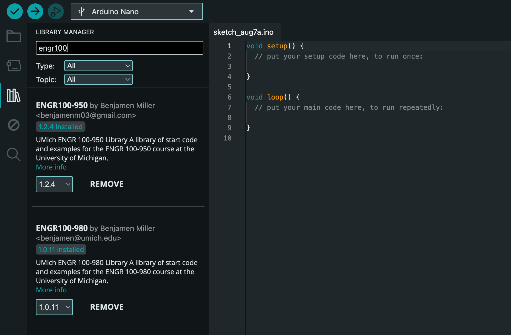
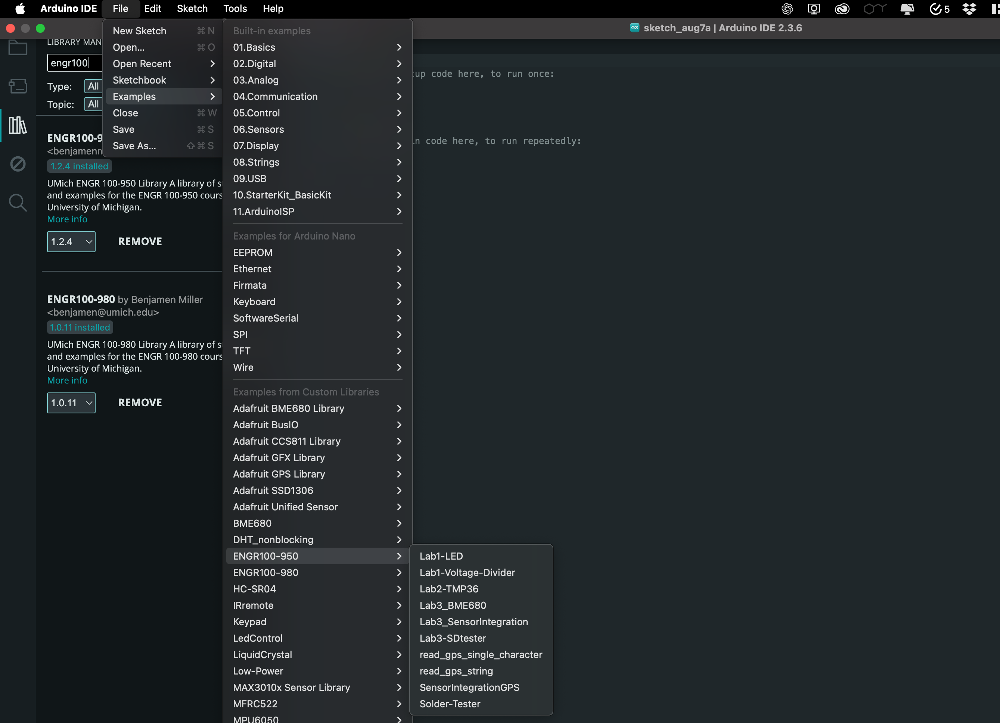

# Tutorials

Walk-throughs on common issues or installations.

## Contents

- [Tutorials](#tutorials)
  - [Contents](#contents)
  - [Arduino IDE Install](#arduino-ide-install)
    - [Windows](#windows)
    - [macOS](#macos)
    - [Linux](#linux)
    - [Chromebook](#chromebook)
  - [Arduino Library](#arduino-library)
  - [Arduino IDE Usage](#arduino-ide-usage)
    - [Using the Starter Code](#using-the-starter-code)
    - [Saving Code](#saving-code)
    - [Connecting to an Arduino](#connecting-to-an-arduino)
    - [Uploading Code](#uploading-code)
    - [Viewing Arduino Output](#viewing-arduino-output)
  - [KiCad Install](#kicad-install)
  - [KiCad Net Labels and Power Labels](#kicad-net-labels-and-power-labels)
  - [Installing Omnissa Horizon Client](#installing-omnissa-horizon-client)

## Arduino IDE Install

### Windows

1. [Download the latest release](https://downloads.arduino.cc/arduino-ide/arduino-ide_latest_Windows_64bit.exe)
2. Follow the instructions in the installation guide.
3. When completing the setup, leave _Run Arduino IDE_ ticked to launch the application, or launch it later from the Start Menu.

### macOS

1. Download the latest release
   - [Intel, 10.14: "Mojave" or newer](https://downloads.arduino.cc/arduino-ide/arduino-ide_latest_macOS_64bit.dmg)
   - [Apple Silicon, 11: "Big Sur" or newer](https://downloads.arduino.cc/arduino-ide/arduino-ide_2.1.1_macOS_arm64.dmg)
2. Double-click the disk image (.dmg) file.
3. Drag and drop the Arduino IDE application into the Applications folder.
4. Launch Arduino IDE the same way you would launch any other application (such as <kbd>Command + Space</kbd> for Spotlight and search for “Arduino”).

### Linux

1. [Download the latest release](https://downloads.arduino.cc/arduino-ide/arduino-ide_latest_Linux_64bit.AppImage)

2. Find the AppImage file in your file manager.

3. Make the AppImage file executable:

   1. Right-click the file.
   2. Choose Properties,
   3. Select the Permissions.
   4. Tick the _Allow executing file as program_ box.

4. Double-click the AppImage file to launch Arduino IDE.

If Arduino IDE fails to open, and you see the text `dlopen(): error loading libfuse.so.2` or `AppImages require FUSE to run`, you may be missing some dependencies. Follow these steps:

1. Open the Terminal application.

2. Enter this command:

   `sudo apt-get -y install libfuse2`

3. Press `Enter` and wait for the process to complete.

4. Close the Terminal window.

5. Try launching Arduino IDE again by double-clicking the AppImage file.

### Chromebook

See [this guide](https://support.arduino.cc/hc/en-us/articles/360016495639-Use-Arduino-with-Chromebook).

*Note: We as instructional staff have **not** tested all of the Arduino labs on a Chromebook, so some features may not work as intended.*

## Arduino Library

After running the Arduino IDE, either click the library manager on the left (looks like some books), or press <kbd>Ctrl+Shift+I</kbd>.

In the bar that says "Filter your search..." type "ENGR100-950" and press <kbd>Enter</kbd>.

Click on the "Install" button on the library. If no errors pop-up, you are good to go!

## Arduino IDE Usage

### Using the Starter Code

For the majority of projects in our class, we will give you sample starter code for each lab. These are packaged in the library you downloaded in the step above. If you have not yet installed this library, [do so now](#arduino-library)!

To access this starter code within the Arduino IDE, go to File>Examples>ENGR 100-950, and click on the desired starter code.

### Saving Code

Whenever you modify anything in this code, you will need to specify where you want it to save on your computer. **Arduino IDE does NOT auto-save your code!**

To save, press <kbd>Ctrl + s</kbd> (or <kbd>Command + s</kbd> for Mac), pick a location, and name it something. It is recommended you make a folder somewhere accessible on your computer for you to save all of your code onto for this class. This will make it easier to find to reference or submit later.

To open your projects again, go to File>Open, or double click on the `.ino` file right from your file manager, which should open it in the Arduino IDE.

### Connecting to an Arduino

To start, we need to tell the Arduino IDE which type of Arduino we are using (in our case, an Arduino Nano), and which port it is located at.

To do this, either select the "Select Board" dropdown

and choose the Arduino Nano and whatever port shows up when it is plugged into your computer like so:

.

Alternatively, you can open Tools>Board and specify the board and port quickly from there. This looks like this:

From this dropdown you can choose the Arduino Nano and specify which port you would like to connect on.

When you plug in Arduino, it _should_ show up in the list of options for the port regardless of which way you specify the port. If it is not showing up, before asking for help, try:

1. Unplugging and re-plugging the Arduino / USB cables
2. Force quitting the Arduino IDE (after saving your work!) and relaunching it
3. Unplugging all of the wires connecting to pins on your Arduino. If there are shorts or if things are wired incorrectly or on the wrong pins, it can cause your Arduino not to show up.

Once the Arduino port shows up, select it.

### Uploading Code

When you have an Arduino plugged in and ready to go, you will need to verify and upload your code. With no Arduino plugged in, you can test that your code will compile either by pressing the check-mark in the top left of the IDE, or by pressing <kbd>Ctrl + R</kbd>. If this runs successfully you know you are ready to upload to an Arduino!

When your Arduino is plugged in, you don't need to compile/verify, the upload button will do that for you. Simply press the right arrow or <kbd>Ctrl + U</kbd> and watch the progress.

If your code is failing to upload to your Arduino, try the troubleshooting steps listed above, as well as trying to press and hold the reset button on the Arduino for a period of time and continue holding it while plugging it into the computer. Sometimes this can help an Arduino that is stuck executing code forever to take a break to accept your new code.

Additionally, if uploading is failing, try changing to a different bootloader. This is under tools, and you can try switching between the old and new bootloaders.

### Viewing Arduino Output

Arduinos have 2 main ways of interfacing and displaying data on your computer. These are through the Serial Monitor, and the Serial Plotter. Both are accessible via the buttons in the top right-hand corner of the Arduino IDE.

Both of these connections only work when an Arduino is plugged in and the port is specified correctly. Additionally, you will need to confirm that the baud rate - the speed at which the Arduino and your computer agree to exchange data at - is set the same for both your computer and your Arduino. This is configurable from Serial Monitor in the top right hand corner of the console in the bottom of your screen. The default for most instances is 9600 baud.

## KiCad Install

The first link below is to the download page hosted by KiCad. Feel free to use this option to download the latest release. The links listed below that option are direct downloads for the different operating systems with the most current release as of January 12, 2026 (version 9.0.7).

To use the general download page, pick your operating system and then choose the North America GitHub download option:
[https://www.kicad.org/download/](https://www.kicad.org/download/)

Direct download links for version 9.0.7:

- Windows x64 (9.0.7): [https://github.com/KiCad/kicad-source-mirror/releases/download/9.0.7/kicad-9.0.7-x86_64.exe](https://github.com/KiCad/kicad-source-mirror/releases/download/9.0.7/kicad-9.0.7-x86_64.exe)
- Windows ARM64 (9.0.7): [https://github.com/KiCad/kicad-source-mirror/releases/download/9.0.7/kicad-9.0.7-arm64.exe](https://github.com/KiCad/kicad-source-mirror/releases/download/9.0.7/kicad-9.0.7-arm64.exe)
- macOS universal (9.0.7): [https://github.com/KiCad/kicad-source-mirror/releases/download/9.0.7/kicad-unified-universal-9.0.7.dmg](https://github.com/KiCad/kicad-source-mirror/releases/download/9.0.7/kicad-unified-universal-9.0.7.dmg)

## KiCad Net Labels and Power Labels

The schematic editor is essentially a connection guide for the PCB editor that comes later. Wires (the green lines) show direct connections, while **net labels** create the same underlying electrical connection without drawing the wire across the page. This keeps schematics clean and readable while still telling KiCad exactly how every pin must connect.

Net labels may be useful when:
- The same signal appears in multiple places (for example, `GND`, `VCC`, `3V3`, `MOSI`, `MISO`, `SCK`).
- A connection would require long, messy wires that criss-cross the page.
- You want repeated or standard connections to look consistent and easy to trace.
- You are connecting across sheets (global or hierarchical labels).

Use wires when:
- The connection is local and short.
- The wire itself helps communicate the flow of the circuit (e.g., a simple resistor-divider or op-amp feedback loop).

### How net labels work
- Any wires (or pins) that share **the exact same net label text** are connected electrically, even if there is no green wire drawn between them.
- A net can only have one name. If you place multiple different labels on the same net, KiCad will flag it in ERC.
- Labels have scope: **local labels** connect within a sheet, **global labels** connect across the entire schematic, and **hierarchical labels** connect between parent and child sheets in a hierarchical design.

### Power labels (power symbols)
Power labels are specialized net labels that use power symbols (like `GND`, `VCC`, `+5V`, `+3V3`). They behave like **global labels**: any matching power symbol connects to the same net everywhere in the project. This is why you can place `GND` symbols all over a schematic without drawing wires between them.

### How to place a net label
1. Click the **Net Label** tool (right toolbar) for same-sheet connections.
2. Click on a wire end (or directly on a wire) and type the net name.
3. Place the same label anywhere else that net should connect.

Tip: the tiny square at the edge of a label shows the connection point. When it is snapped to a wire, the square disappears.

### Examples (photos)
Below are screenshots showing where the buttons are located for net labels

## Installing Omnissa Horizon Client
The Windows Remote Desktop Service allows eligible individuals at Michigan Engineering to remotely access the CAEN Lab Software Environment (CLSE) for Windows. It is intended to provide the same experience as being in a CAEN computer lab.

1. Follow instructions here to install VMware to your computer. **This software is essential for Mac users to run Altium.**
[https://teamdynamix.umich.edu/TDClient/76/Portal/KB/ArticleDet?ID=5311](https://teamdynamix.umich.edu/TDClient/76/Portal/KB/ArticleDet?ID=5311)

2. To connect VMware to the CAEN server:  
[https://teamdynamix.umich.edu/TDClient/76/Portal/KB/ArticleDet?ID=5309](https://teamdynamix.umich.edu/TDClient/76/Portal/KB/ArticleDet?ID=5309)

Note: Connecting to the Windows Remote Desktop Service from off-campus networks will require use of the [U-M VPN client](https://its.umich.edu/enterprise/wifi-networks/vpn/getting-started).

